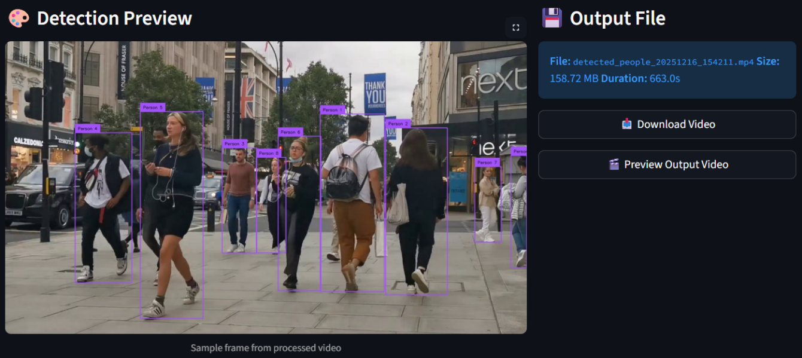
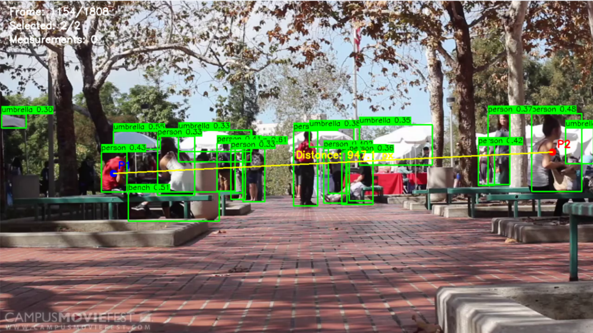
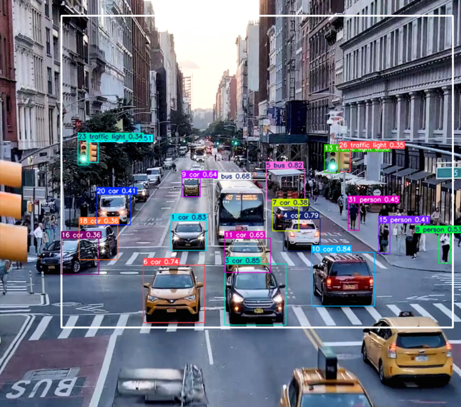

# DIP-Final-Project

Research and implementation of **YOLO (You Only Look Once)** with three practical applications using **Ultralytics YOLO11**.

---

## YOLO Model

**YOLO (You Only Look Once)** is a real-time object detection algorithm that predicts bounding boxes and class probabilities in a single neural network pass. This design makes YOLO extremely **fast and efficient for real-time computer vision tasks**.

Official Website:  
https://ultralytics.com/yolo

Documentation:  
https://docs.ultralytics.com
---

## 1. Live Inference with Streamlit Application using Ultralytics YOLO11

## 2. Distance Calculation using Ultralytics YOLO11

## 3. TrackZone using Ultralytics YOLO11

---

## Installation

Make sure Python (>=3.8) is installed.

Install required libraries:

```bash
pip install ultralytics
pip install streamlit
pip install opencv-python
